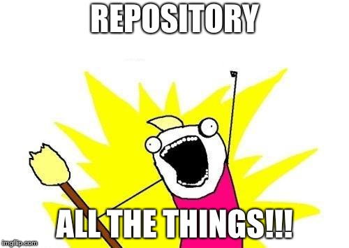

# Working with repositories
In Git, repositories are special directories that track their own content.  As the files and the contents within them change over time, Git remembers versions of this history using commits.  Each commit has a 40-character SHA hash associated with it so it can be uniquely identified.

 

    

  


Navigate to your "repository home" for these labs before you begin: _yourUserDirectory_/MasterGitInADay


### A: Initialize a repository

1. Ensure you are in your _repository_ home directory by running `pwd`.  If you aren't in the right place, navigate there using `cd <yourUserDirectory>/MasterGitInADay`
1. Create a folder here for a new repository called "YourName_Repo1": `mkdir YourName_Repo1`
1. Navigate into this folder using `cd YourName_Repo1` Pro tip: If you type `cd `, then the first few letters, and then hit tab, it should autocomplete for you.  This works for all terminal commands!
1. Use `git init` to turn this folder into a local git repository
1. Ensure you can see the .git folder.  In the terminal, you can list all files (including hidden ones starting with a period) using `ls -al`.  If you're also looking at the files in a file *explorer* (GUI), you may need to configure it to show all files & folders.
1. Use `git status` to check out what's going on.  You should see "no commits yet".

### B: Clone a repository

1. Move out of the repository you're currently in (the one you created in the steps above).  Do this by typing `cd ../`
1. Now, rather than creating a repository on your machine from scratch, you're going to clone one from BitBucket.  Clone [this repository](https://bitbucket.com/lyndseypadget/LPadget_Repo1) using the URL provided by BitBucket's green "clone or download" button.  (You may have to use a HTTPS or SSH depending on the way you configured Git.)  The command will look like `git clone <URL>`.
1. Type  `ls -al` to see that the repository was cloned successfully into a folder with the name LPadget_Repo1.
1. Move into this folder with `cd LPadget_Repo1`.  Look around with `pwd` and `ls -al`.
1. Back on the command line, move back up a directory again with `cd ../`.
1. Repeat the clone command (hint: hit the up arrow in your terminal a few times until you find it) except **this time** provide one more argument.  The additional argument will become the name of the folder this repo gets downloaded into.  So your command should look like `git clone <url> Part1-B-Step6`.
1. After the command completes, type `ls -al`.  Notice that there is a folder named `Part1-B-Step6`.
1. Once again, move into the directory with the `cd` command.  It's the same repo contents - the only thing that has changed is the name of the folder it's in.  Neat!
1. Move back up to your repository home with `cd ../`

### C: Add a remote
In Git, remotes are connections between repositories.

1. Using the `cd` command, move into the folder of the repository you initialized in the beginning of Part 1 A called `YourName_Repo1`.
1. Run `git remote -v` to list your remotes.  Notice that there are none.
1. In BitBucket, login using your username.  Create a new public repository with the same name: `YourName_Repo1`.  Do *not* initialize the repository with a readme, .gitignore, or license file.
1. After creating it, BitBucket will give you command-line instructions for connecting your local *existing* repository with this one you just created in the cloud.  It's under "My code is already tracked by Git".  Since you're already in the appropriate folder, you can skip the first command and just run the last three.
1. Run `git remote -v` again to list your remotes.  You should see `origin https://bitbucket.com/yourBitBucketUsername/YourName_Repo1.git` twice - once for fetching and once for pushing.

### D: Create and commit a file
These steps are necessary because we want to have something (at least one commit) to push to a remote repository.  Pushing means sending code outward (uploading), to a remote repository. Pulling means taking code inward (downloading), from a remote repository.

When modifying the contents of files (we use txt files for simplicity), it's best to add a new line in the file for each change.


1. Ensure you are in the directory called `<yourUserDirectory>/MasterGitInADay/YourName_Repo1`.
1. Create an empty file called file1.txt: `touch file1.txt`.
1. Type `ls -al` to see that the new file exists.  If you're also looking at the files in a file *explorer* (GUI), you may need to configure it to show file *extensions* so you see "file1.txt" instead of "file1".
1. Open file1.txt using vim: type `vim file1.txt`.
1. Once vim is open, remember to type `i` to get into insert mode.  **Then** type the text `Part1-D-Step5`.
1. Save the changes by hitting the escape key (to exit insert mode) then `:wq` and hit enter.
1. Use `git status` to see that this file is untracked, in red.  Pro tip: You can hit the up arrow to go back in your command history, which also saves you typing and time!
1. Use `git add file1.txt`, which stages it.
1. Run `git status` again to see that the file is staged (listed under the "Changes to be committed" section, in green)
1. Run `git commit -m "Initial commit"` to make a commit with that message.  Note the commit hash that is produced (just the first 7 characters, after "master (root-commit)").  Pro tip: You can commit with simply `git commit` (without the `-m` argument), but it will open vim for you to write a commit message there.

### E: Push code to the new remote
Pushing means sending code outward (uploading), to a remote repository.  Pulling means taking code inward (downloading), from a remote repository.

1. We're now ready to push our first and only commit to the remote repository in BitBucket: `git push -u origin master`.  You can tell that it worked because it will say `Writing objects: 100%`.
1. In the browser, refresh your BitBucket repository to see that the file you added is there.  You'll see "1 commit", which is the same commit (and same commit hash!) as the commit you made locally.  The time reflects the time the commit was made, not when it was pushed.

### F: Now we're going to **delete your local Git repository**.

Imagine that this directory is full of code, and you're about to blow it away!  Come on... It's like a Git trust fall.  It's going to be fun.

1. In the terminal, we'll assume you're still in your `<yourUserDirectory>/MasterGitInADay/YourName_Repo1` folder.  Move up a directory with `cd ../`.
1. Remove the directory with the force and recursive options.  **This command is powerful and dangerous.  Measure twice, cut once!** `rm -rf YourName_Repo1`
1. Ensure it worked by listing the contents of the directory you're in with `ls -al`.
1. Back in BitBucket, find the clone URL for your repository.  This is the "Clone" option on the left-hand menu the repository.  Copy this URL.
1. Now we're going to get the repository back on your local machine by using the clone command in the terminal: `git clone <the_clone_url>`
1. Confirm that the repository is there again by listing the contents of the directory again.  (You know how to do this, I believe in you.)  Congratulations, you just brought sexy back!
1. Don't forget to move back into the repository directory with `cd YourName_Repo1`.
1. In the newly cloned repository, run `git remote -v` to see that the origin remote was automatically set up for us.  How convenient!
1. In vim, open `file1.txt` again.  Add a line that says `Part1-F-Step9`.  Remember to save it!
1. Now create another (new, empty) file called `file2.txt` using the touch command.
1. Type `git status` to see that one file is modified and one file is untracked.
1. Stage both of these changes with `git add .` and inspect again with `git status`.
1. Commit with `git commit -m "I changed a file and added another"`
1. Push this commit to your *origin* remote with `git push origin master`.  (Pro tip: `git push` would also work, but being explicit can be a good habit.)
1. In BitBucket, notice that you now have two commits and (coincidentally) two files.
1. Still in BitBucket, click on `file2.txt` and see that it's empty.  Click the pencil icon to edit the contents of the file.
1. Add a line of text that says `Part1-F-Step17` to this file using the BitBucket editor.
1. At the bottom, enter "I added a sentence" in the commit description.  (An extended description is not needed... unless you just want the typing practice.)
1. Leave the default radio button selected (use master branch) and click the green button to commit.
1. Back in the terminal, pull these changes using `git pull origin master`
1. Now open file2.txt in vim and behold, there is text!  Pat yourself on the back - you just pushed and pulled your way to the end of Part 1.


The `.` (period) means "all files"

