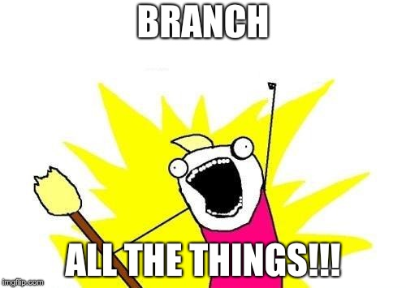

# Branches & Conflicts
Within a repository, multiple branches can exist.  Branches are like parallel universes of the same code base.  Typically one or two developers works on a specific task or feature on a branch.  When two people modify the same line of code in different ways, Git doesn't know what to do - you have to tell it.  This is a conflict, and you have to play the role of code traffic cop to decide what code can move forward.  This process is called conflict resolution.

 

    

  


PR means pull request.


1. Create a new branch called cool-stuff
1. Look at the history with `log`
1. Now make it more visual with `log --graph`
1. Now make it less verbose with `log --graph --oneline`
1. Move to the branch you made with `checkout cool-stuff`
1. Change a file, then `add`, `commit`, and `push` it
1. Make another branch (from the cool-stuff branch) with `checkout -b rad`
1. View history thus far: `log --graph --oneline`
1. Change a file, then `add`, `commit`, and `push` it
1. Make a PR for rad to go into cool-stuff
1. Now change the PR for rad to go into master
1. Back in your local repo, Change a file, `add`, `commit`, and `push` it (to rad)
1. Notice that the PR (which is backed by the rad branch) has been updated
1. Owner of the repo: move to the master branch with `checkout` master
1. Ensure you have the latest code with `pull origin master`
1. Now make a change to the same file - and same line - your partner has modified in the rad branch. `add`, `commit`, `push`.
1. Notice that your partner’s PR is now in conflict
1. Partner: get the latest changes with git `fetch`
1. From the rad branch, git `merge master`
1. Resolve conflicts
1. Mark the conflicts as resolved using `add`.  Then `commit` and `push`.
1. Notice that the PR can safely be merged again
1. Approve and merge the PR
1. Give your partner write access to the master branch. In GitHub, this can be found in the repository settings.
1. Have your partner push a change directly to master
1. Now try to push a similar change, it will be rejected (Why?)


You can Google lots of different ways to format and prettify your logs.



Do you see the typical flow of tracking changes?  We always `add`, `commit`, `push`.



On small projects with one or two people, pushing to master directly is normal.  In the professional world, this is rarely done, because everyone **must** use pull requests.

