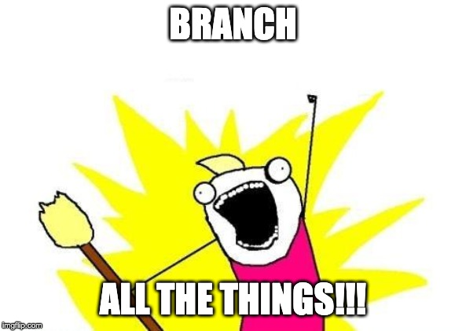

# Branches & Conflicts
Within a repository, multiple branches can exist.  Branches are like parallel universes of the same code base.  Typically one or two developers works on a specific task or feature on a branch.  When two people modify the same line of code in different ways, Git doesn't know what to do - you have to tell it.  This is a conflict, and you have to play the role of code traffic cop to decide what code can move forward.  This process is called conflict resolution.

 

    

  


PR means pull request.


### A: Make branches &amp; inspect history

1. In the terminal, navigate to your repository (if needed).  (Pro tip: If you aren't sure where you are, use `pwd`).  Also ensure that your working directory is "clean" by typing `git status`.  There should be no modified or untracked files.
1. Create a new branch called cool-stuff, and check it out: `git checkout -b cool-stuff`
1. Look at the history with `git log`.  (Pro tip: You may have to use Ctrl+Z or q to get out of "log mode")
1. Now make it more visual with `git log --graph`
1. Now make it less verbose with `git log --graph --oneline`
1. Change file1.txt again: let's add `Part3-A-Step6` to the bottom.  Then stage and commit this change.  (I'm letting go of the handlebars... you got this!)
1. Push the change up to remote repository, but specifically to the `cool-stuff` branch.  The first time you do this, you have to tell Git that these two branches (the local and remote branches) are the same with the `-u` option: `git push -u origin cool-stuff`.  (Pro tip: The `-u` is not needed on subsequent pushes/pulls.)
1. Make another branch (from the cool-stuff branch) with `git checkout -b rad-stuff`.  The rad-stuff branch's parent is cool-stuff, and the cool-stuff branch's parent is master.
1. View history thus far: `git log --graph --oneline`
1. Change file1.txt again: add `Part3-A-Step10` to the bottom.  Then add, commit, and push it [to the rad-stuff branch].
1. In your repository in BitBucket, open the file to view its contents.  Use the branch dropdown to see how the same file has different contents in each branch.
1. In BitBucket, on the left menu, click Branches.
1. Click the "..." button and then choose "Create pull request" on the rad-stuff branch.  This means we want to make a pull request for the rad branch to be merged into some other branch.  This is process most teams follow when a developer wants to merge their code into the main branch.
1. By default, the destination branch selected is `master`.  Scroll down and see how file1.txt differs between these two branches.
1. Change the destination branch to be `cool-stuff`.  Scroll down again and notice that the differences are fewer now.  This is because the `cool-stuff` branch contains an intermediate version of the file, where some (but not all) changes also exist.
1. Click the green button to "Create the Pull Request"


You can Google lots of different ways to format and prettify your logs.



Do you see the typical flow of tracking changes?  We always `git add`, `git commit`, `git push`.


### B: Update the PR

1. Back in your local repo (on the rad-stuff branch), change file1.txt again, then add, commit, and push it.
1. Notice that the PR (which is backed by the rad-stuff branch) has been updated in BitBucket.
1. On the PR, click the "Merge pull request" -> "Confirm merge" buttons.  This merges the rad-stuff branch into the cool-stuff branch.
1. Locally in the terminal, move to the cool-stuff branch: `git checkout cool-stuff`
1. In the remote (cloud / BitBucket) repository, the cool-stuff branch now contains rad stuff!  But your local repository doesn't know about it.  Let's get these changes: `git pull origin cool-stuff`
1. Ensure you have the latest code with `git pull origin master`
1. In BitBucket, move to the **master branch** and edit (using the pencil) file1.txt.  Specifically, change the first line of the file.  Then commit it.
1. Locally, ensure you're still on the `cool-stuff` branch.  (Pro tip: `git status` will tell you!)
1. Modify the first line of file1.txt **in a different way**.  Then add, commit, and push it.
1. Create a PR from the `cool-stuff` branch into the `master` branch.  Notice that conflicts are detected, because the two branches have different versions of the same line.  Git can't figure out what to do!
1. You could resolve conflicts using the BitBucket editor, but that's probably not going to help you if you have 10 C# files with conflicts.  (Not to mention, BitBucket may not be your provider.)  Let's do this locally instead.
1. In the terminal, from the `cool-stuff` branch, type `git pull origin master`.  This gets the latest code from master (which cool-stuff didn't previously know about) and attempts to merge it into your local `cool-stuff` branch.
1. Open `file1.txt` and resolve the conflict.  Then save the file and tell git we're done: `git add .` and `git commit -m "Resolved conflict"`.
1. Everything is cool in our local repo, but the remote repo is still... conflicted.  Push this change to the _remote_ cool-stuff branch: `git push origin cool-stuff`.  Notice that the PR is happy.  Merge that bad boy!
1. Locally, move to the master branch.  Update the local master branch with what's happened in the remote master branch.


On small projects with one or two people, pushing to master directly is normal.  In the professional world, this is rarely done, because everyone **must** use pull requests.  This gives others the opportunity to review in an effort to ensure quality.

