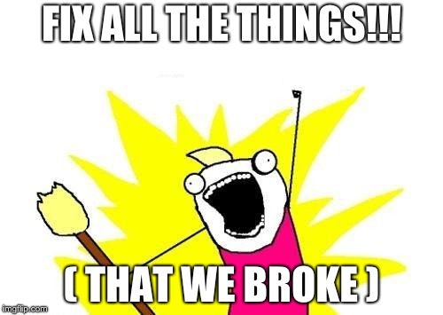

# Fixing really bad mistakes (bad commits after pushing)
Well, now you've done it.  You pushed some bad code to an otherwise good branch.  Or maybe you pushed some good code to the *wrong* branch.  Or maybe your code is good, but you just weren't finished with it yet, or it contained sensitive data, and you never really meant for other humans to see it.  Now some humans can see and get your code, and things are going to get awkward.

This happens to professionals, more often than most will admit.  Depending on the kind of mistake you made, your strategy for fixing it will vary.

 

    

  


Remember that creating a branch will do so from whichever branch you happen to be on *when you do it*.  It's a good habit to always move back to your "base branch" (such as master) before creating a new branch, so you don't implicitly diverge from the wrong branch.


### A: Commit good code to the wrong branch
1. Create a branch (from master) and move to it.  Call it `good`.
1. Create a file called `file3.txt`, then add, commit, and push it.
1. Move back to the master branch using `git checkout master`
1. Create another new branch from master called `bad` and move to it.
1. Create a file called `file4.txt`, then add, commit, and push it.
1. Notice that these changes are present in the GitHub (remote) repository.
1. But... oops!  We meant to push the addition of `file4.txt` change to the good branch, not the bad branch!  Move to the good branch with `git checkout good`.
1. Use `git cherry-pick <commit_hash>` (from here, the good branch) to _copy_ the commit from bad branch to the good branch.  (Pro tip: you can find the commit hash using GitHub's Code tab -> Commits.  Ensure you have the `bad` branch selected.  Or, locally, you can get the hash using `git log`.)
1. Remember that - just like all git operations - this is done locally.  (There's no need to commit anything, since it actually just made a new commit on this `good` branch!)  Push the change to the remote repo.  See it in GitHub?  So satisfying!
1. But the commit still exists on the bad branch.  Now what?


Cherry-picking doesn't move a commit, it copies it.  You still have to remove the old commit from the bad branch.


### B: Undo the commit with revert
1. Move to the bad branch.  From there, `git revert <commit_hash>`, where the commit hash is the one that shouldn't have been made on the `bad` branch.  Note that this will pop open your configured editor (i.e. vim) with a default commit message.  You don't need to do anything to this file except save and close it.
1. Using `git log` you can see that a new commit exists which effectively undoes whatever was done in the bad commit.
1. Remember that local changes must be `git push`ed to the remote repository!  Do that now!
1. Verify that you can see the "undo" (revert) commit in the GitHub repo.

### C: The nuclear option: reset and force push

Reset should look familiar to you - we used it in part 2 for [un]staging.  Reset tells Git to move the HEAD ref to the specific commit you provide.  It assumes you want to get move to a previous commit and undo any commits thereafter.

Because `git reset` is destructive, you can't simply `git push` this to the remote repository.  You must **force** `git push` it.  Force pushing changes (or, rewrites) history for whoever else might be using the same branch.  It's like pulling the bottom layer out from under their Jenga tower.  Their code foundation is gone or drastically different, and major problems will ensue.  Because of this, **force pushing is NEVER ok to do when other people are using the branch!**  

1. We want to *forcibly* go back to the commit _before_ any of this ever happened.  Find that commit and `git reset <commit_hash>`, where commit_hash is the last good commit before the badness (file4.txt) was introduced.
1. See what this did using `git log`.
1. Force push this change using `git push -f`
1. In GitHub, verify that you no longer see the bad commit nor the commit that undid it.  It's like... it's been erased.
  

    

