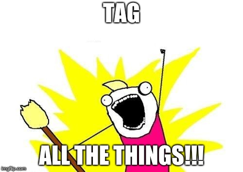

# Team Workflows & Release Management
So far, we've learned and used concepts that are sufficient for collaborating with one or two people on a hobby project.  In the professional world, the code bases and the teams are bigger.  That code is tested, versioned, released to end users, and then supported and maintained.  Workflows refer to the guidelines teams adhere to, by convention, to keep work organized.  The way code is merged into the main branch (master) can also vary, but should be standardized amongst all team members.

 

    

  

### A: Tagging
1. Ensure you're on the master branch, locally.
1. You should now have quite a few commits to work with in your master branch.  Choose a commit a few revisions back and tag it (lightweight) as "0.0.1": `git tag 0.0.1 <commit_hash>`
1. Choose a commit after that point and tag it (annotated) as "0.0.2": `git tag -a 0.0.2 <commit_hash> -m "look at me, making a tag"`
1. Remember that changes must always be pushed to the remote repository.  Even tags.  Yes, really.  Do this with `git push origin --tags`.
1. In BitBucket, go to Commits to see your tags there, on the right.

### B: Gitflow
1. From the master branch, create a new branch called develop
1. From the develop branch, create a new branch called feature-123
1. Make 2 or more commits on this branch and `git push` them to the remote repository.
1. Make a pull request from the feature-123 branch into the develop branch.  Merge it in.
1. Make a pull request from the develop branch into the master branch.  Merge it in.
1. Remember to pull these changes into your local branches (develop and master) after merging using `git pull`.


In a real environment, you probably wouldn't merge your own PRs (because, why?).  Rather, someone would review and approve it.  Then they (or you) merges it in.  Typically an architect, team lead, or QA would merge develop - which represents one to many features - into master for a release.  Tagging can be done after this step.


### C: Squashing
1. Repeat steps 2 and 3 of the Gitflow steps above (this time call the branch something else)
1. On step 4, use BitBucket's dropdown for the Merge strategy to specify that you would like to *squash* the commits when merging.  Then click the Merge button.
1. Notice that the history is now more concise: multiple commits from the PR have been *squashed* into one.
1. Remember to update your local develop branch with these changes.

### D: Rebasing
1. Repeat steps 2 and 3 of the Gitflow steps above (this time call the branch something else)
1. On step 4, use BitBucket's dropdown on the Merge button to specify that you would like to *rebase* the commits, then merge.  Then click the Merge button.
1. Notice that the history is different.  A merge commit is not present.
1. Remember to update your local develop branch with these changes.
