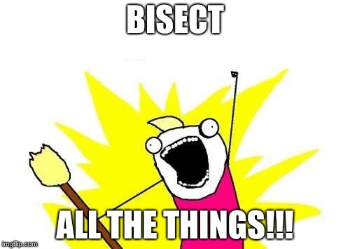

# Advanced techniques
As you can see by now, Git is very powerful.  There are many more things it can do, but here are some of the most common ways to "level up" your newly acquired Git skills!

 

    

  

### Stashing

1. Make some changes to files in your repo, but `stash` them instead of committing them.

For bonus points, Google how to see what's in the stash and observe the code you just pushed there.

1. Get them back from the stash using `stash apply`

### Aliases
1. Create a few helpful aliases.  Some suggestions are below.  This will depend on what kind of terminal you have, so Google it.

Aliases can be set temporarily (locally in the current shell instance) or permanently (globally in the all shell instances).  You want the latter.

  1. `alias s="git status"`
  1. `alias log="git log"`
  1. `alias p="git checkout master && git pull origin master"`
  1. `alias dif="git difftool --no-prompt"`
1. Ensure your aliases are permanent by closing your terminal completely and restarting it.  (Do they still work?)

### Diffing
1. Consider using a tool for comparing unstaged changes to the original version of a file.  Some options are below (some are free, some are not).  Google how to configure git to use this tool by default (when `difftool` is run).  Modify some files and try it out to see if it's working!
  1. Beyond Compare
  1. Meld
  1. WinDiff

### Bisect
1. Let's pretend that a problem was introduced between two commits ("good", and later, "bad") in your master branch history.  Read about the `bisect` command and use it to triangulate the [pretend] problem.

### Worktrees
1. Worktrees can be very handy if your team adheres to the GitFlow model, because you don't often interact with the master branch but you would like to have a copy of it nonetheless.  Read about `worktrees` and make a folder designated to the master branch, while you continue to actively work off develop from another folder.

Worktrees are very confusing if you do not have a *very* firm grasp on branching fundamentals.  While they can be helpful in short-term situations, I have found that keeping them around indefinitely leads to confusion and mistakes.


### Submodules
1. `submodule`s are best explored in a brand new repository.  Go back to the skills you learned in part 1 to set up a few new repositories and try it out!

Like worktrees, submodules can lead to confusion if you don't firmly understand some of the basics we've learned today.  Submodules are often used for enterprise-level applications that span departments - not just teams - and use a "plug and play" architecture.  NPM dependencies can also solve these problems (arguably, better?), so it's best to read and weigh all options before making a large-scale decision.

